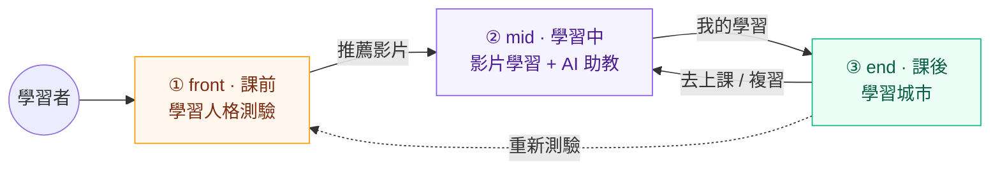
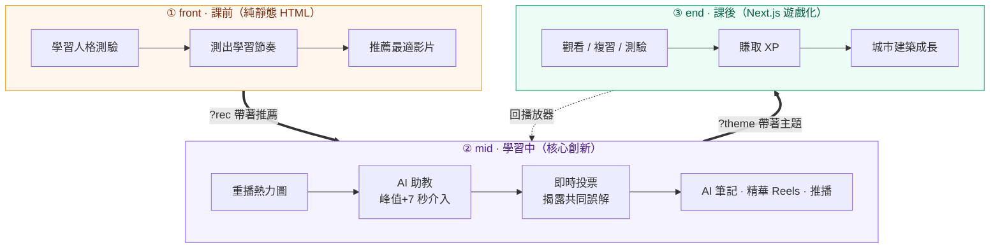
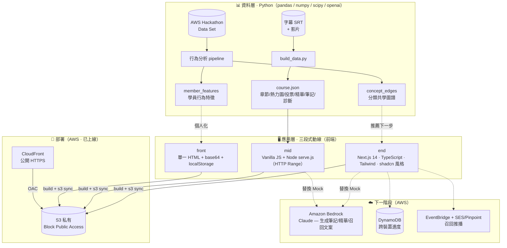
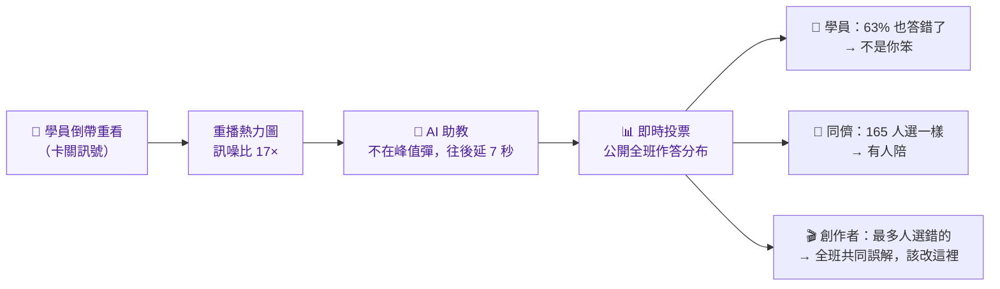
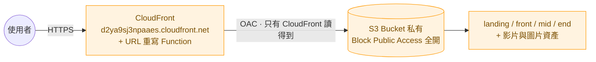

# 拜託讓我比 · 技術架構
>
> AWS Hackathon 2026 ｜ PressPlay Academy (PPA) 線上學習體驗改造

🔗 **線上 Demo（部署於 AWS）：https://d2ya9sj3npaaes.cloudfront.net** ｜ 架構：S3（私有）+ CloudFront
🔗 備用鏡像（GitHub Pages）：https://jasonliu0101.github.io/ppa/

---

## 30 秒速覽

| | |
|---|---|
| **題目** | 線上課程的完課率與黏著度困境 |
| **洞察** | 學員卡住時**不會發問，而是把影片倒回去重看** —— 那一下倒帶就是他舉手的方式 |
| **方案** | 課前（測學習人格）→ 學習中（把倒帶變成 AI 介入的訊號）→ 課後（遊戲化養成，獎勵「回來」而非「連續」）|
| **資料** | 由主辦方資料集分析出**學員行為特徵**與**分類共學圖譜**，驅動整條動線 |
| **落地** | 前端原型完成，AI 以 Mock 對齊真 API 結構，可無痛接上 **Amazon Bedrock (Claude)** |



---

## 💡 洞察：倒帶，是學習者舉手的方式

現行的線上課程 AI 助教活在側邊欄，**等你去問它**。但學習者卡住的時候不會發問 —— 他會把影片倒回去，再聽一次。這個專案把「重播」當成第一級訊號：

| | 暫停 | **重播** |
|---|---|---|
| 語意 | 模糊（接電話、去倒水） | **只有一個意思：我剛剛沒聽懂** |
| 訊噪比 | 差 | **17×**（峰值 323 人 / 基線 19 人）|

> 反向驗證：業配段在重播熱力圖上是一道**低谷** —— 沒有人會倒回去重看業配。這條低谷證明我們量到的是「理解困難」，不是「流量」。

---

## 🗺️ 三段式學習動線



三端共用一個 localStorage key `ppa-theme`，深／淺色在三段之間**跟著走**；跨埠時靠網址參數 `?theme=` 攜帶。

---

## 🏗️ 系統架構



### 技術棧

| 段 | 角色 | 技術 |
|---|---|---|
| **front** | 課前測驗 | 純 HTML、圖片 base64 內嵌、localStorage、響應式 |
| **mid** | 影片學習原型 | Vanilla JS、Node `serve.js`（支援 HTTP Range 讓影片可 seek）、Python 資料 pipeline |
| **end** | 學習城市 | Next.js 14（App Router）、TypeScript strict、Tailwind、shadcn 風格自建元件、React Context + useReducer、`react-zoom-pan-pinch` |
| **資料** | 分析與建置 | Python：pandas / openpyxl / numpy / scipy / openai |
| **AI** | 內容生成 | 目前 Mock（結構對齊真 API）→ 可接 Amazon Bedrock (Claude) |

---

## 🔬 核心創新：把「倒帶」變成一份餵三個人的訊號（mid）



**為什麼延後 7 秒？** 峰值那一刻學員正在聽最關鍵的那句話，這時候糊他一張卡，是在製造下一次倒帶。等他聽完，再問「要不要幫你？」

**五個介入點不是亂灑的** —— 峰值精準落在四種認知負荷上（數字密集、專有名詞、學術引用、操作步驟），且**全部命中影片的圖卡**。這證明認知負荷可以從逐字稿預測，也正是這套方法能自動化的前提。

同一份訊號換一個人看，就是**創作者後台**：不只說「這段有問題」，而是給出「拆成 4 個分鏡、每個參數停留 3 秒、結尾補一張總表卡」這種**可以動手做**的診斷。

---

## 🎮 三段功能亮點

| front｜課前測驗 | mid｜影片學習 | end｜學習城市 |
|---|---|---|
| 學習人格測驗 | 重播熱力圖（進度條柱子） | 8 棟建築對應 8 種學習分類 |
| 測出學習節奏 | AI 助教兩段式介入（mini → full） | 觀看/複習/測驗 → 賺 XP → 建築升級 Lv.1–5 |
| 深淺色雙套配色 | 名詞小窗（就地展開，不離開影片） | 記憶卡 / 測驗 / 精華複習中心 |
| 推薦最適影片進 mid | 即時投票（揭露共同誤解） | 學習時間軸（不標記失敗日）|
| | 精華 Reels（卡關點剪成 14–30 秒短片，有聲）| 可愛召回通知（正向回歸）|
| | 主動推播（依內容排程「睡前那次最重要」）| **獎勵「回來」而非「連續」** |
| | 創作者後台（診斷 + 改善建議 + 成本/影響）| |

---

## 📊 資料驅動

主辦方資料集經 Python pipeline 分析，產出兩份驅動動線的資料：

- **`member_features.csv`** — 學員行為特徵（購買、活躍天數、學習/探索/社群/搜尋/挑戰/打卡/AI 提問/觀看…）→ 用於學員分群與個人化。
- **`concept_edges.csv`** — 分類共學圖譜（如「個人品牌經營 × 養生保健」有 53 人共學）→ 用於「推薦下一步學什麼」。
- **`build_data.py`** — 把字幕 SRT + 影片打包成播放介面吃的 `course.json`（章節 / 重播熱力圖 / 投票 / 精華 clip / 筆記 / 診斷）。

---

## ☁️ AWS 部署（已上線）

整條動線已實際部署在 AWS，符合黑客松「以 AWS 為主、雲原生、非 EC2」與「勿建公開 S3」的要求：



- **純 Serverless**：只用 S3 + CloudFront，完全不碰 EC2 / RDS / Security Group
- **S3 不對外公開**：Block Public Access 全開，只有 CloudFront 透過 **OAC（Origin Access Control）** 簽章存取 → 符合「請勿建立公開對外的 S3 Bucket」
- **CloudFront Function** 在邊緣把 `/front/` 這類目錄請求改寫成 `/front/index.html`

### 下一階段：接上生成式 AI

AI 功能目前以 Mock 實作、**回傳結構與正式 API 完全一致**，上線只需替換函式內部：

| 能力 | AWS 服務 |
|---|---|
| 生成記憶卡 / 精華 / 召回文案 | **Amazon Bedrock（Claude）** |
| 跨裝置進度同步 | localStorage → **DynamoDB** |
| 召回推播排程與發送 | **EventBridge** + **SES / Pinpoint** |
| 行為埋點（關鍵）| 補上 `video_replay` 事件與秒數 —— 這是把「模擬訊號」換成「真訊號」的第一步 |

---

## 🚀 快速開始

```bash
# 一鍵啟動三段（front + mid 於 :8899，end 於 :3000）
bash prototype/start.sh
# 打開 http://localhost:8899 —— 從課前測驗開始走整條動線

# 重新產生 mid 的課程資料
python3 prototype/tools/build_data.py
```

| | 網址 |
|---|---|
| **線上 Demo** | https://d2ya9sj3npaaes.cloudfront.net |
| 動線入口（課前測驗） | http://localhost:8899 |
| mid 創作者後台 | http://localhost:8899/mid/creator.html |
| end 學習城市 | http://localhost:3000 |

---

## 📁 專案結構

```
aws-hackathon-2026/
├── prototype/
│   ├── front/          課前人格測驗（單一 index.html）
│   ├── mid/            影片學習原型
│   │   ├── app.js · styles.css · creator.*   學員端 + 創作者後台
│   │   ├── serve.js                          支援 Range 的靜態伺服器
│   │   ├── data/course.json                  ← build_data.py 產生
│   │   └── tools/build_data.py               SRT → 章節/熱力圖/投票/精華/筆記
│   ├── end/            學習城市（Next.js 14 + TypeScript）
│   └── start.sh        一鍵啟動三段
├── out/                資料分析產出（concept_edges · member_features）
└── requirements.txt    Python 依賴
```
