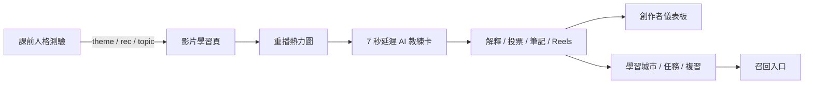
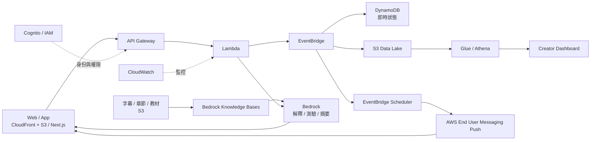

# LearnPulse 技術架構

## 1. 架構判讀

LearnPulse 的核心不是「再做一個 AI 聊天框」，而是把學員的重播行為轉成可追蹤的學習訊號：先找到多人卡住的秒數，再於正確時機提供解釋、測驗、精華與召回，最後以恢復率與完成率驗證成效。

目前專案是三段式可操作原型，尚未正式串接雲端與生成式 AI；簡報中的 AWS 元件均屬目標架構。

| 階段 | 目前實作 | 角色 |
|---|---|---|
| `prototype/front` | 單頁 HTML 測驗與推薦，透過 query string 傳遞主題 | 課前分流 |
| `prototype/mid` | Vanilla JS 影片頁、重播熱力圖、AI 教練卡、投票、筆記、Reels、推播排程、創作者後台 | 課中介入與內容改善 |
| `prototype/end` | Next.js 14、Context + `useReducer`、`localStorage`，含 XP、學習城市、複習與任務 | 課後留存與召回 |

目前限制：熱力圖與投票母體以固定種子模擬；AI 回答為預寫內容與本地檢索；尚無登入、雲端事件、真實推播或正式 A/B 分流。

## 2. 現況資料流



## 3. 目標 AWS 架構



### 服務責任

- CloudFront + S3：靜態前端與媒體分發；若保留 Next.js SSR，可改由 Amplify Hosting 或容器承載。
- API Gateway + Lambda：接收事件、計算介入資格、回傳即時 UI 狀態。
- EventBridge：解耦 `replay`、投票、介入、恢復與內容改善流程。
- DynamoDB：保存 session 內的介入狀態、門檻版本、去重鍵與短期學習進度。
- S3 + Glue + Athena：保存匿名化事件並產生課程熱點、漏斗與 cohort 報表。
- Bedrock Knowledge Bases：以課程字幕、章節與教材做 RAG，回傳可追溯來源。
- EventBridge Scheduler + AWS End User Messaging：在學員卡住後延遲召回，deep link 回到相同秒數或精華片段。
- Cognito、IAM、CloudWatch：身分、最小權限、稽核、錯誤率與延遲監控。

## 4. 最小事件契約

所有事件至少包含：`event_id`、`event_name`、`occurred_at`、匿名化 `user_id`、`session_id`、`course_id`、`lesson_id`、`schema_version`。

```json
{
  "event_id": "01J...",
  "event_name": "video_replay",
  "occurred_at": "2026-07-15T12:00:00Z",
  "user_id": "sha256:...",
  "session_id": "sess_...",
  "course_id": "course_01",
  "lesson_id": "lesson_03",
  "schema_version": 1,
  "payload": {
    "second": 128,
    "from_second": 151,
    "playback_rate": 1,
    "device_class": "desktop"
  }
}
```

建議事件：

- `video_replay`：`second`、`from_second`、`playback_rate`
- `poll_answer`：`question_id`、`answer_id`、`is_correct`
- `intervention_shown`：`intervention_id`、`type`、`trigger_rule_version`
- `intervention_accepted` / `intervention_dismissed`：`latency_ms`、`reason`
- `recovery`：`window_seconds`、`continued_watch_seconds`、`chapter_completed`
- `recall_sent` / `recall_opened`：`schedule_id`、`channel`、`deep_link_target`

去重以 `event_id` 為準；分析層以事件時間處理，避免網路延遲造成秒數誤排。

## 5. 介入與 RAG 流程

1. 先以真實 `video_replay` 建立課程基線，門檻採課程內相對值，不用全站單一固定數字。
2. 學員進入熱點後先等待 7 秒；若已自行離開、暫停或關閉提示，就取消本次介入。
3. Lambda 取當前秒數所屬字幕、章節與名詞，向 Knowledge Base 查詢來源。
4. 模型依介入型別產生短解釋、單題測驗、摘要或精華建議。
5. 回傳 `source_id`、`confidence`、模型與 prompt 版本；低信心時只顯示原始教材或不介入。
6. 記錄是否採用及後續 60 秒行為，形成可驗證的 recovery 指標。

## 6. 信任、隱私與安全

- 重播只能代表「可能卡住」，不能推論情緒、能力或心理狀態。
- 事件使用匿名化 ID，避免收集不必要的文字輸入與個資；設定保存期限與用途同意。
- 學員可關閉、略過或延後提示；召回通知需有頻率上限與退訂機制。
- AI 回答顯示資料來源；創作者改課建議維持 human-in-the-loop。
- 建立離線評測集，檢查正確性、來源支援度、拒答與不當介入率。
- IAM 採最小權限，敏感資料以 KMS 加密，CloudWatch 留存必要稽核紀錄。

## 7. 驗證設計

第一階段先量測：事件完整率、熱點穩定性、提示展開率、投票率、介入後 60 秒持續觀看、章節完成率與重播下降率。

第二階段做同課程熱點隨機分組：

- Control：不介入。
- Treatment：延遲 7 秒介入。
- 觀察 4 週，依新／舊學員分層。
- 主要指標：卡點後恢復率；護欄指標：提示關閉率、退訂率、錯誤回答率與載入延遲。

商業指標如 7 日留存、續購與完課後購買，必須透過 cohort 或實驗歸因，不能只比較介入前後。

## 8. 八週落地順序

| 週次 | 交付物 | Gate |
|---|---|---|
| W1–2 | 真實事件 SDK、資料字典、匿名化與同意 | 事件完整率 ≥ 95% |
| W3–4 | 真實熱點、基線儀表板、創作者 pilot | 熱點可重現且能對應內容 |
| W5–6 | Bedrock RAG、來源引用、離線評測集 | 回答通過人工與自動評測 |
| W7–8 | 延遲介入 A/B、Scheduler 召回、歸因報表 | recovery 提升且護欄無惡化 |

## 9. 本機 Demo 啟動注意事項

- 執行 `bash prototype/start.sh`，front/mid 使用支援 HTTP Range 的 Node server。
- `prototype/end` 內的導頁目前硬編碼到 `localhost:3000`，啟動前必須確認 3000 port 沒有舊服務占用；若 Next.js 自動改到 3001，跨頁流程會失效。
- Demo 前以 `?selftest=1` 執行 mid 自測；目前已驗證 13 項皆通過。

