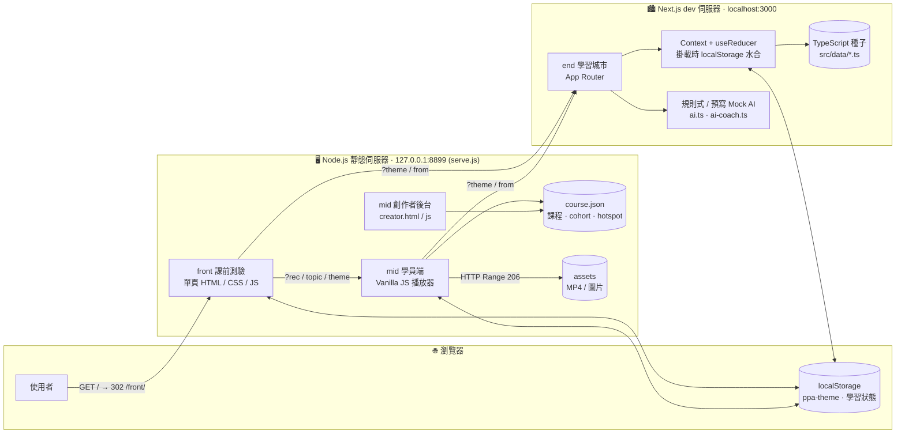
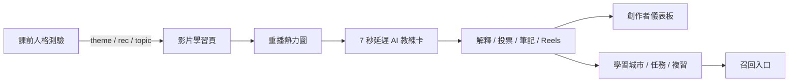
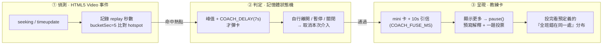
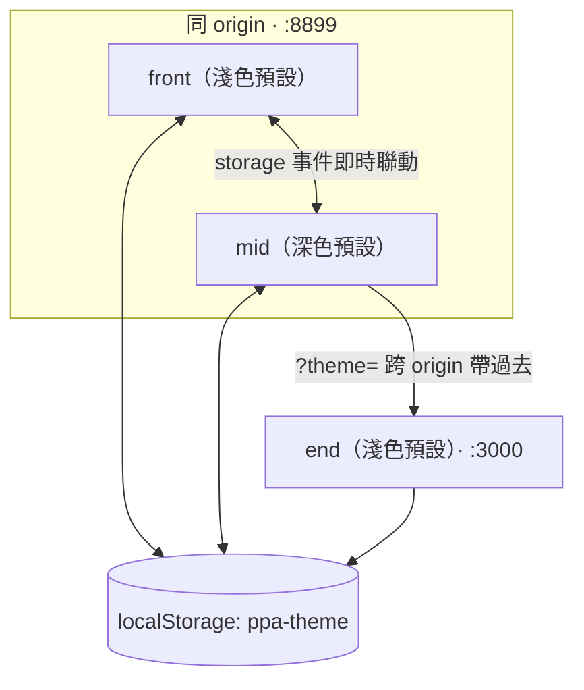

# PPA 技術架構


## 1. 架構判讀

目前是**可操作的三段式原型**，尚未正式串接雲端與生成式 AI；文中的 AWS 元件均屬目標架構。無登入、無後端 API、無資料庫、無雲端事件、無真實 A/B 分流；所有資料為預寫種子（`course.json` / TypeScript seed），狀態靠瀏覽器 `localStorage` 保存。

| 階段 | 目前實作 | 角色 |
|---|---|---|
| `prototype/front` | 單頁 HTML 測驗與推薦，透過 query string 傳遞主題 | 課前分流 |
| `prototype/mid` | Vanilla JS 影片頁、重播熱力圖、AI 教練卡、投票、筆記、Reels、推播排程、創作者後台 | 課中介入與內容改善 |
| `prototype/end` | Next.js 14、Context + `useReducer`、`localStorage`，含 XP、學習城市、複習與任務 | 課後留存與召回 |

---

## 2. 系統執行架構

三端在兩個本機伺服器上跑，靠 URL query 與共用 `localStorage` 串起來。



**啟動**：`bash prototype/start.sh` 一鍵起 `serve.js`(:8899) 與 end(:3000)。`serve.js` 根路徑 `GET /` 以 **302 導向 `/front/`**、影片以 **HTTP Range(206)** 分段回應；end **是 3000**。

---

## 3. 專案檔案結構

```
prototype/
  serve.js          front + mid 的統一靜態伺服器（:8899、302 導向、HTTP Range）
  start.sh          一鍵啟動 serve.js + end 的 Next dev
  front/            課前人格測驗（單一 index.html；midURL() 組 ?rec/topic/theme）
  mid/              PPA 影片學習原型（app.js 播放器 × 熱力圖 × 教練卡 × 投票 × Reels）
    data/course.json  課程 · cohort(n=486) · hotspot 種子
    assets/           video.mp4 · cover · thumbs
    creator.html      創作者後台
  end/              學習城市 Next.js 14.2.15（詳見 end/README.md）
    src/app/          courses · review · tasks · building 等路由
    src/lib/store.tsx Context + useReducer + localStorage
    src/data/*.ts     buildings · courses · review · tasks 種子
    src/lib/ai*.ts    規則式 / 預寫 Mock AI
```

---

## 4. 現況資料流



---

## 5. front — 課前分流

- 單一 `index.html`（HTML/CSS/原生 JS），可獨立部署；由 `serve.js` 在 `:8899` 提供，根路徑 `GET /` 以 302 導到這裡。
- **5 題人格測驗** → 算出學習節奏，以**雷達圖**呈現學習人格（碎片化學習型／中場休息型／專注深潛型／探索嘗鮮型）。
- 結果頁推薦對應影片；點推薦時 `midURL()` 組出 `../mid/?rec=<影片名>&topic=<主題>&theme=<light|dark>` 導入 mid（mid 收到會以 toast 打招呼顯示 `rec`）。
- 測試捷徑 `front/?demo=result` 跳過測驗直接看結果頁，用來驗證「點影片 → 進 mid」的串接。

---

## 6. mid — 課中介入

核心互動：學員反覆倒帶某一秒 → 系統判定「可能卡住」→ 延遲彈出 AI 教練卡。

### 6.1 關鍵常數（取自 `app.js` / `course.json`）

| 常數 | 值 | 意義 |
|---|---|---|
| `COACH_DELAY` | `7` 秒 | 熱點峰值後延遲 7 秒才彈教練卡（燈泡對齊觸發點，非峰值） |
| `COACH_FUSE_MS` | `10_000`（10 秒） | mini 卡的自動消失「引信」；滑鼠移上去會暫停引信 |
| `cohort.n` | `486` | 熱力圖／投票母體（**預寫模擬值**） |
| `cohort.bucketSec` | `5` | 熱力圖每 5 秒一格 |
| 鍵盤 ← / → | `±5` 秒 | 影片快退／快進 |
| 卡片 ↺ 鈕 | `10` 秒 | 倒退 10 秒回到卡點 |

### 6.2 介入管線



### 6.3 mid 功能清單

* 重播熱力圖 `buildHeat()`
* 7 秒延遲教練卡
* 即時投票
* 筆記
* 精華 Reels（卡點剪成 14–30 秒直式短片）
* 主動推播排程 `wirePush()`
* 創作者後台 `creator.html`。

---

## 7. end — 課後學習城市

- Next.js 14 App Router，路由：`courses` / `review` / `tasks` / `calendar` / `timeline` / `notifications` / `building/[id]`。
- 狀態：`store.tsx` 以 `createContext` + `useReducer`，掛載時從 `localStorage`（`STORAGE_KEY`）水合、變更寫回。
- 資料：`src/data/*.ts` 全為 TypeScript 種子；AI 為規則式／預寫 Mock。
- 遊戲化：XP（`xp.ts`）、等級、學習城市（`InteractiveCity.tsx`，可縮放平移）、複習卡、任務。「去上課」先把觀看記進城市狀態，回來時城市已長大，形成正向回饋。

---

## 8. 三端主題聯動



三端共用 key **`ppa-theme`**（`light`/`dark`）。同 origin（front↔mid）用 `storage` 事件即時聯動；跨 origin（→ end）靠 `?theme=` 帶過去。載入優先序：網址 `?theme=` ＞ `localStorage` ＞ 各自預設。
